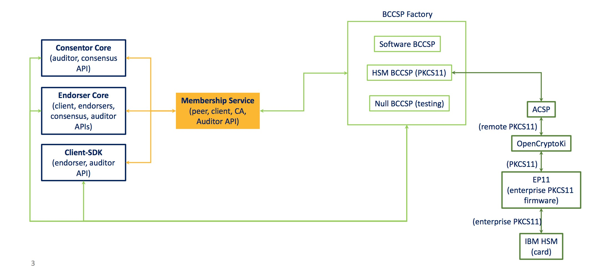

| 原文 | 作者 | 审核修正 |
|---|---|---|
| [原文](https://jira.hyperledger.org/secure/attachment/10124/BCCSP.pdf) |Dijun Liu  |  |

## 什么是BCCSP

BCCSP全称是**区块链密码服务提供者**，用来提供区块链相关的算法标准和他们的实现。

**bccsp.go**

    // BCCSP is the blockchain cryptographic service provider that offers
    // the implementation of cryptographic standards and algorithms.
    type BCCSP interface {

    	// KeyGen generates a key using opts.
    	KeyGen(opts KeyGenOpts) (k Key, err error)

    	// KeyDeriv derives a key from k using opts.
    	// The opts argument should be appropriate for the primitive used.
    	KeyDeriv(k Key, opts KeyDerivOpts) (dk Key, err error)

    	// KeyImport imports a key from its raw representation using opts.
    	// The opts argument should be appropriate for the primitive used.
    	KeyImport(raw interface{}, opts KeyImportOpts) (k Key, err error)

    	// GetKey returns the key this CSP associates to
    	// the Subject Key Identifier ski.
    	GetKey(ski []byte) (k Key, err error)

    	// Hash hashes messages msg using options opts.
    	// If opts is nil, the default hash function will be used.
    	Hash(msg []byte, opts HashOpts) (hash []byte, err error)

    	// GetHash returns and instance of hash.Hash using options opts.
    	// If opts is nil, the default hash function will be returned.
    	GetHash(opts HashOpts) (h hash.Hash, err error)

    	// Sign signs digest using key k.
    	// The opts argument should be appropriate for the algorithm used.
    	//
    	// Note that when a signature of a hash of a larger message is needed,
    	// the caller is responsible for hashing the larger message and passing
    	// the hash (as digest).
    	Sign(k Key, digest []byte, opts SignerOpts) (signature []byte, err error)

    	// Verify verifies signature against key k and digest
    	// The opts argument should be appropriate for the algorithm used.
    	Verify(k Key, signature, digest []byte, opts SignerOpts) (valid bool, err error)

    	// Encrypt encrypts plaintext using key k.
    	// The opts argument should be appropriate for the algorithm used.
    	Encrypt(k Key, plaintext []byte, opts EncrypterOpts) (ciphertext []byte, err error)

    	// Decrypt decrypts ciphertext using key k.
    	// The opts argument should be appropriate for the algorithm used.
    	Decrypt(k Key, ciphertext []byte, opts DecrypterOpts) (plaintext []byte, err error)
    }

**代码译注**

**秘钥生命周期管理**
1. GenKey - 产生秘钥
2. DeriveKey -派生秘钥
3. GetKey - 获取秘钥
4. ImportKey - 导入秘钥

**签名验签操作**

5. Sign -签名
6. Verify -验签

**加解密操作**

7. Encrypt - 加密操作
8. Decrypt - 解密操作

##  Hyperledger Fabric中BCCSP的整合方式

**框图译注**

BCCSP Factory 主要提供3种BCCSP实现。

- 软件实现 Software BCCSP
- 基于PKCS11的硬件实现 HSM BCCSP (PKCS11）
- 测试用的空实现 Null BCCSP (testing)

BCCSP通过Membership Service（成员服务提供者）给相关核心功能和客户端SDK提供加密算法相关的服务。
相关核心功能集中在core中，包括共识模块，背书模块等。

## BCCSP设计目标

* 可插拔
    - 在不改变核心代码的情况下，可以使用多种加密实现方式
* 提供多种CSP
    - 可以添加多种CSP，比如不同的硬件实现
    - 允许在不同的模块上面使用不同的CSP
* 支持国际标准
    - 通过新的CSP来做支持
    - 不需要对不同标准之间的互通做保证

## BCCSP秘钥

**bccsp.go**

    // Key represents a cryptographic key
    type Key interface {

    	// Bytes converts this key to its byte representation,
    	// if this operation is allowed.
    	Bytes() ([]byte, error)

    	// SKI returns the subject key identifier of this key.
    	SKI() []byte

    	// Symmetric returns true if this key is a symmetric key,
    	// false is this key is asymmetric
    	Symmetric() bool

    	// Private returns true if this key is a private key,
    	// false otherwise.
    	Private() bool

    	// PublicKey returns the corresponding public key part of an asymmetric public/private key pair.
    	// This method returns an error in symmetric key schemes.
    	PublicKey() (Key, error)
    }

KEY描述了密码相关的秘钥，秘钥可以是**对称**的或者**非对称**的。

如果是非对称的，那么秘钥还分为**公钥**和**私钥**两种

如果是私钥的话，它还可以通过`PublicKey()`来获取对应的公钥

秘钥可以通过Subject Key Identifier (GetSKI)来索引。

## 秘钥生命周期

为了进行密码相关的操作，需要产生相应的秘钥（**译注**：并且维护相应的秘钥状态，比如存储，索引）

**bccsp.go**

     GenKey(opts GenKeyOpts) (k Key, err error)

**bccsp.go**

    // KeyGenOpts contains options for key-generation with a CSP.
    type KeyGenOpts interface {

    	// Algorithm returns the key generation algorithm identifier (to be used).
    	Algorithm() string

    	// Ephemeral returns true if the key to generate has to be ephemeral,
    	// false otherwise.
    	Ephemeral() bool
    }

`GenKey`可以通过不同的opts来控制，产生不同种类的秘钥

对于开发者来说，至少需要为指定生成秘钥的算法和是否是短期秘钥。如果是长期秘钥的话，则需要通过SKI来完成存储和索引

短期秘钥的话，如果没有地方再引用了，会自动被销毁。

值得注意的是，除了这两个方法，其他任何的参数，你都可以在实现此接口`GenKeyOpts`的时候加上。

---

有时需要通过已有的秘钥派生新的秘钥

**bccsp.go**

    DeriveKey(k Key, opts DeriveKeyOpts) (dk Key, err error)

**bccsp.go**

    // KeyDerivOpts contains options for key-derivation with a CSP.
    type KeyDerivOpts interface {

    	// Algorithm returns the key derivation algorithm identifier (to be used).
    	Algorithm() string

    	// Ephemeral returns true if the key to derived has to be ephemeral,
    	// false otherwise.
    	Ephemeral() bool
    }

`DeriveKey`允许从已有秘钥派生一组新的秘钥（比如通过HMAC或者重新随机生成）。通过适当的opts可以选择不同的派生方法。

同`GenKey`，对于开发者来说，至少需要为指定生成秘钥的算法和是否是短期秘钥。如果是长期秘钥的话，则需要通过SKI来完成存储和索引。

同`GenKey`，值得注意的是，除了这两个方法，其他任何的参数，你都可以在实现此接口`DeriveKeyOpts`的时候加上。

## 签名验签能力

**bccsp.go**

    // Sign signs digest using key k.
    // The opts argument should be appropriate for the algorithm used.
    //
    // Note that when a signature of a hash of a larger message is needed,
    // the caller is responsible for hashing the larger message and passing
    // the hash (as digest).
    Sign(k Key, digest []byte, opts SignerOpts) (signature []byte, err error)

    // Verify verifies signature against key k and digest
    // The opts argument should be appropriate for the algorithm used.
    Verify(k Key, signature, digest []byte, opts SignerOpts) (valid bool, err error)

**bccsp.go**

    // SignerOpts contains options for signing with a CSP.
    type SignerOpts interface{}

BCCSP通过`Sign`，`Verify`提供签名验签。

通过秘钥的种类来决定签名验签的算法，比如传入ECDSA的秘钥就使用ECDSA的签名算法。

其他任何的参数，你都可以在实现此接口`SignerOpts`的时候加上。

## 加解密能力

**bccsp.go**

	// Encrypt encrypts plaintext using key k.
	// The opts argument should be appropriate for the algorithm used.
	Encrypt(k Key, plaintext []byte, opts EncrypterOpts) (ciphertext []byte, err error)

	// Decrypt decrypts ciphertext using key k.
	// The opts argument should be appropriate for the algorithm used.
	Decrypt(k Key, ciphertext []byte, opts DecrypterOpts) (plaintext []byte, err error)

**bccsp.go**

    // EncrypterOpts contains options for encrypting with a CSP.
    type EncrypterOpts interface{}

    // DecrypterOpts contains options for decrypting with a CSP.
    type DecrypterOpts interface{}

BCCSP通过`Encrypt`，`Decrypt`提供加密/解密。

通过不同种类的秘钥类型和opts来决定使用的加密算法（**译注**：这和签名验签不同，这里会使用opts来决定使用的模式）。
举个栗子，如果秘钥是AES的，那么opts就会用来决定操作的模式。

可以在实现`EncrypterOpts`/ `DecrypterOpts`的时候添加任何你想要定制的参数。(**译注**： 这里原文注释有错误，写成了SignerOpts)

## 摘要能力 译者增加表述
(原文由于版本原因，没有列出hash)

**bccsp.go**

    // Hash hashes messages msg using options opts.
	// If opts is nil, the default hash function will be used.
	Hash(msg []byte, opts HashOpts) (hash []byte, err error)

	// GetHash returns and instance of hash.Hash using options opts.
	// If opts is nil, the default hash function will be returned.
	GetHash(opts HashOpts) (h hash.Hash, err error)

**bccsp.go**

    // HashOpts contains options for hashing with a CSP.
    type HashOpts interface {

    	// Algorithm returns the hash algorithm identifier (to be used).
    	Algorithm() string
    }

BCCSP通过`Hash`来提供摘要能力

不同种类的hash算法可以通过不同的opts来获取（比如md5或者SHA256）

