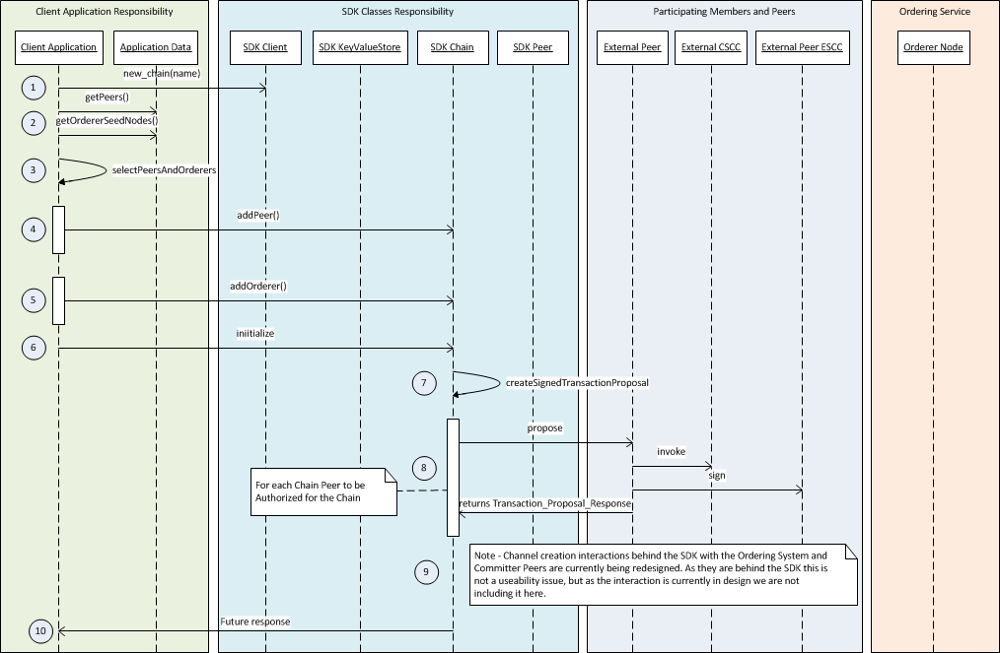
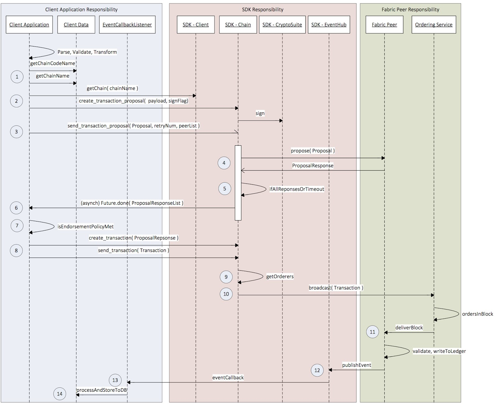

| 原文 | 作者 | 审核修正 |
| --- | --- | --- |
| [原文](https://docs.google.com/document/d/1R5RtIBMW9fZpli37E5Li5_Q9ve3BnQ4q3gWmGZj6Sv4/edit) | Lidong Guo |  |

## 1 概要
Hyperledger Fabric v1.0提供了基本的Protocol Buffers 格式的API通过gRPC协议作用于区块链网络。这些API包含了交易处理、安全的成员关系服务、区块链遍历和事件处理。有很多编程语言支持Protocol Buffers，包括Go, C#, Java, Javascript, Python, and C++。所以有必要给应用开发工程师提供一个本地SDK。

本文档详述了一个SDK应该提供的API最小集合的实现。一个SDK的目标即要解决客户在区块链网络中直接面对的一些原始需求；又要做一些顶层的合理抽象以图方便开发人员开发，并且在本地应用代码中使用这些API后方便开发工作的进行。然而，使用SDK并不会妨碍应用直接调用gRPC的操作。

请注意，当前的REST API并不被推荐使用，SDK不应该基于使用REST API 而创建。跳过REST直接使用gRPC的原因是：能够控制全双向的数据流（大部分的API调用都是异步的），更好的性能。此外，自从节点内部模块通信使用了gRPC之后，便不必再开放更多的HTTP/HTTPS端口了。

一个例外的情况是，新的成员服务方式（CA）是按REST API的规则实现的

作为参考，Fabric v1.0的架构和交互模型可以在下面这个链接所指向的工作单元的附件文档里面查看 https://jira.hyperledger.org/browse/FAB-37

## 2 目标

### 2.1 应用开发

Fabric SDK应该可以为开发人员提供编写应用程序的多种操作区块链网络的方式。应用程序可以部署/执行chaincode，监听网络中产生的事件，接收块信息，把交易存储到账本中，等等

### 2.2 chaincode开发

Fabric SDK应该可以为开发人员提供编写chaincode单元测试代码。开发人员应该能够在不把chaincode部署到网络上的情况下快速测试chaincode

## 3 原则

### 3.1 良好的API文档，数据模型，示例代码

SDK应该提供清晰的文档说明，包括可用的API，数据模型，如何使用API的示例说明

### 3.2 便于使用

Chaincode开发人员和应用程序开发人员关注于书写业务逻辑代码。尽管开发人员熟悉fabric内部构件对开发本身是有利的，但是这不应该是一个必须的先决条件。SDK编译时间上不应该对fabric project有任何依赖。（除非原始文件定义了多种合约？？） SDK packages/jars/libraries 应该在常用的资源库网站上可获取，以方便开发人员可以轻松安装它们或者立即开始编写Chaincode来开发应用程序。

### 3.3 性能

这个SDK必须仔细设计来达到高吞吐量，水平扩展能力和更低的延迟。它（本SDK）应该是一个组件状态无关化的理想实现，或者允许应用实例借助数据库共享状态。

### 3.4 版本控制

统一的版本控制下，建议将SDK通过多种语言实现，并且多种实现的SDK之间在功能上能够保持互通

### 3.5 可服务性

本SDK应该方便于在可服务性支持中添加插件，即日志系统。它应该允许SDK使用方的应用添加一个日志处理的实例。应用倾向于在SDK内部和外部使用一个通用的日志系统，这是非常有用的。一个IT组织为了监视和分析通常会安装日志脚本，比如对一个标准日志格式的需求。本SDK应该有一个编译进版本的日志系统以便于开发人员通过默认方式获取日志。但是它必须允许设置一个拥有一系列标准集合的外部日志系统来记录API日志。

## 4 场景

有许多种可能的场景，但是让我们关注一少部分来说明SDK的整体功能。

### 4.1 成员的注册和登记

为了跟fabric交互，应用程序必须具备一个专有的身份认证，这个认证被编码进一个叫做ECert（登记证书）的成员证书里。这个证书可能是由外部的认证机构提供，或者由fabric成员服务提供，只要这个ECert可以被fabric组件在建立链的信任链时验证即可。

如果用一个标准的CA来管理分配ECert，交易会被ECert签名。这将使得每一个交易对于每一个客户端都是可验证的。

另一方面，MSP在fabric中的设计是，利用一个加密算法从ECert的密钥对导出一个密钥对，因此为每一个交易产生一个假名证书，又叫做TCert。一个TCert不能代表一个认证的身份，但是能通过成员服务追踪到原始的ECert。这个技术在许多业务场景下隐藏交易认证是非常有用的。

Fabric提供了MSP接口的一种实现，命名为“COP”立意来源于它的作用就像警察，而不是来源于首字母。在github的组织超级账本里面的代码库“fabric-cop”就是它。（译者注：在github上hyperledger组织下并未找到这个代码库，可能是本文档成书后又有变更。）

如果给一个基于fabric的网络配置一个外部的CA，然后用户注册也会在外部维护。这个外部的用户注册系统负责认证用户。一个已经被认证的用户为了获取ECert可以使用CA请求登记。

就SDK而言，应该有两种API：支持任何CA（包括内建的和外部的）的通用API，和专门为fabric的内建成员服务提供的API。通用API负责允许使用SDK的应用程序执行最基本的操作比如关联用户身份，命名为“enroll()”，为认证用户获取ECert的程序；还有“getTCerts()”，获取交易证书允许用户提交交易。

客户端有关可选的成员服务实现（即COP）的设计需要单独的文档来说明。https://docs.google.com/document/d/1TO-sdHGpn8ifB9C_pH_y54H75Rx0RdXvZih7-lhsLII/edit

### 4.2 链的创建

Hyperledger Fabric所设计的支持隐私性和机密性的通道和账本，统一被称为一个“链”。通道和账本设计更多内容请查看：
https://docs.google.com/document/d/1eRNxxQ0P8yp4Wh__Vi6ddaN_vhN2RQHP-IruHNUwyhc/edit#。通信（传输中的数据）被限制在参与方之间的通道内，同时块内数据（已被持久化的数据）保存在一个私有的仅仅在这些参与方之间分布式存储的账本中。不属于链的网络节点不了解通道和私有账本内部任何事物，也不能利用这些事物。

一旦一个链被创建，应用可以发送交易给链上以私有方式存在的节点，并且已提交被验证的交易到私有账本。

创建链的责任落在应用程序身上。通过SDK应用程序初始化链的组织团体（网络成员的代表）构成并且给排序服务。

在SDK里，通道和它本身关联的账本的绑定由链类体现。应用和指定的排序节点第一次准备一个新的通道并且获取一个包含关于新链的密钥信息的创世区块，包含参与者信息（URL和证书）、排序节点信息（URL和证书）。应用通过目标是配置系统chaincode的配置化交易来协调新通道对参与节点的邀请。

### 4.3 交易支持

一个交易包含明确的两个步骤：背书和提交。背书是请求节点对交易的结果进行运行并背书（签名）；提交是在交易和交易的背书内容的有效期内请求共识。

下图说明交易时客户端SDK和节点之间的交互。更多信息请查看架构文档（https://github.com/hyperledger/fabric/blob/master/proposals/r1/Next-Consensus-Architecture-Proposal.md）。

首先SDK和应用协同工作，使用应用的（或者被认证用户的）私钥给信息签名（所有的外部信息都需要签名认证）。然后它根据背书策略（通过验证系统链码或者VSCC实现的）给一个或多个节点发送信息。它获得异步的反馈并且决定是否执行创建和提交交易到共识服务。执行交易提交的决定是基于背书策略谓词（就像2 out of 3）基于带外知识。一旦提交，交易的处理流程便是异步的，所以SDK监听提交事件来通知应用交易处理流程的完成或者拒绝的结果。

上图是对交易流程非常上层的描述。SDK中有详细的执行网络和环境配置，包括获取签名密钥来安全的管理成员，处理交易和事件流，（依赖应用的）多种共识通道。

## 5 客户端服务器API参考
下面的链接指向gRPC与fabric（节点，排序者和成员服务）沟通的信息和服务定义。

[Proposal](https://github.com/hyperledger/fabric/blob/master/protos/peer/fabric_proposal.proto) （部署或者交易调用的提案）

[ProposalResponse](https://github.com/hyperledger/fabric/blob/master/protos/peer/fabric_proposal_response.proto) （全局的提案回应）

[Chaincode](https://github.com/hyperledger/fabric/blob/master/protos/peer/chaincode.proto) （chaincode，调用，部署，等细节）

[ChaincodeProposal](https://github.com/hyperledger/fabric/blob/master/protos/peer/chaincode_proposal.proto) (chaincode-specific proposal header and payload)

[Transaction](https://github.com/hyperledger/fabric/blob/master/protos/peer/fabric_transaction.proto) (transaction invocation)

[ChaincodeTransaction](https://github.com/hyperledger/fabric/blob/master/protos/peer/chaincode_transaction.proto) (chaincode-specific transaction action payload)

新的COP API是基于json的，需要添加到新的成员服务设计中。

消息定义应该是设计SDK APIs的一个灵感来源。APIs明显没有忠实的反映出消息定义，因为SDK可以使用智能缺省和状态信息来最小化请求的参数。

## 6 详细说明

这里我们讨论设计原则和架构思路。

总的来说，我们有不同等级的（数值越小表示等级越高）一些模块：

**Package: Hyperledger Fabric Client**

| 模块 | 等级 | 功能 |
| ---- | --- | --- |
| Client | 0 | 主要的入口模块。它必须允许用户创建需要的任何对象来执行所有支持的操作，例如直接连接网络，chaincode部署，交易执行，多种查询。另外，基于编码规范和普遍的社区练习，每一种语言的实现也能决定是否添加方便的方法，如sendTransaction(chain, tx)|
| Chain | 1 | 一个链代表一些节点特别形成的一个网络，启动一个共识的通道，在通道中交易可以被独立的处理。一个网络可能有一个或多个链。链上的节点维护一个单独的账本包含交易在链上派发，包括成员关系的任何配置。所有的交易都是在链上发送，一个应用可能操作多个链。|
| Peer | 2 | 代表网络上的计算节点。节点的角色有背书节点和提交节点，它们都在维护着账本。应用可能连接到一定数量的可用的节点 |
| Orderer | 2 | 类似节点，不同的是它代表排序服务的终端，可能是一个单独的节点（开发时本地安装）或者一个网络排序者的代理节点。基于区块链网络的fabric会有一个由多个排序者节点组成的单独的排序服务。应用可以选择信任特定的排序者，或者一部分排序者，或者设置代理去给排序者节点广播交易。|
| User | 2 | 代表在网络上交易的用户。用户实例可以基于登记证书被初始化。证书可以从成员服务或者外部CA获取。理论上，这种用户也能代表网络上的节点成员。然而，这与应用程序无关（这更像是网络管理方面的问题），所以在这个设计中没有开放。|
| Proposal | 3 |登记的用户可以向节点列表提出交易提案来背书交易。一旦接收到背书响应，应用程序可以决定是否已经获取背书签名，是否需要执行提交交易到共识服务。这是关于提案原始的GRPC消息的包装类，它提供了便利的创建方法。| 
| ProposalResponse | 3| 提案调用背书节点的响应，打包背书结果（是或否），签名，等等。这是关于提案响应原始的GRPC消息包装类，它提供了便利的方法来利用它自己的内容（背书，签名，等等）。|
| Transaction | 3 | 登记用户收集了背书之后可以提交交易。交易请求包含背书签名和MVCC+post-image，并且使用排序服务API。交易有两种类型：部署和执行。这是交易有关原始GRPC消息的包装类，它提供了便利的创建方法。|
| CryptoSuite | 3 | 加密模块打包了数字签名算法，非对称加密的密钥对，对称加密的密钥消息，安全的hash和MAC。|

**Package: Member Service** 

| 模块 | 等级 | 功能 |
| --- | --- | --- |
| MemberService | 0 | 这是fabric可选模块的客户端，成员服务。本模块的主要功能是从成员服务获取用户登记证书。另外，这个模块本身或它的扩展类也应该能在fabric默认的成员服务的实现中提供可用的额外的功能，如用户注册功能。|

为了帮助说明以上各模块的关系，我们给出了以下的UML图：

### 6.1 客户端
和终端用户主要的交互处理器。客户端实例提供和网络上的节点，排序者，可选成员服务交互的处理器。应用程序使用SDK需要和多个网络交互，分别通过单独的客户端实例进行。

每个客户端被创建时，应该是使用来自于共识服务的配置数据初始化创建，这些数据包含一个被信任的根的列表，排序节点证书和IP地址，还有一个节点证书列表和可使用的IP地址。这必须是作为应用程序环境的一部分进行的。应用程序负责维护客户端的配置，因为SDK不持久地保存这个对象。

每个客户端实例可以维护几条链代表通道和相关的账本。

* new_chain（创建一个新链）

	根据参数给出的名字创建一个链的实例。这实际上代表“通道”（正如上面解释的），这个调用返回一个空对象。初始化这个通道，这个返回的对象上必须配置一个参与方的背书者列表和排序者节点。
	
	Params （参数）
	
	* name (str):链的名称，推荐使用命名空间防止碰撞
	
	Returns（返回值）
	
	* (Chain instance):未初始化的链的实例
	
* get_chain（获取链）

	获取链的实例。本接口允许保存已存在的链实例供之后的检索，并且在应用程序实例之间共享。记录链的信息是应用程序或者SDK负责的事情。如果应用程序不能查看存储中链的信息，它可以调用另外一种API查询一个或多个节点来获得这些信息。
	
	Params
	
	* name (str): The name of the chain （链的名称）

	Returns
	
	* (Chain instance or None): the chain instance for the name. （以入参命名的链的实例）

	Error:
	
	* The state store has not been set（还没有设置存储状态）
	* A chain does not exist under that name（不存在该名称命名的链）
	
* query_chain_info（查询链的信息）

	这是一个网络调用，用来查询指定的节点上链的信息。目标节点必须是属于目标链，才能够返回请求的信息。

	Params
	
	* name (str): The name of the chain （链名）
	* peers (array of Peer instances): target Peers to query（查询的目标节点）
	
	Returns

	* (Chain instance or None): the chain instance for the name.（以入参命名的链的实例。）

	Error:

	* The target Peer(s) does not know anything about the chain（目标节点不了解链的信息）

* set_state_store（设置状态的存储）

	SDK应该有一个内建的键值存储的实现（建议是基于文件的实现，以便于在开发中设置）。但是生产系统需要通过数据库为更多的稳定存储和聚簇存储备份，所以多种应用程序实例可以通过数据库共享应用状态（备注：应用不需要丰富的状态）。这个API使得存储模块具有可插拔特性，所以应用程序可以选择不同的存储实现。

	Params

	* store (KeyValueStore): instance of an alternative KeyValueStore implementation provided by the consuming app.（使用方应用程序提供的键值存储实现的实例）

	Returns
	
	* None

* get_state_store（获取状态存储）
	
	为client提供的获取状态存储的对象的便利方法

	Params
	
	* None

	Returns

	* (KeyValueStore instance): The KeyValueStore implementation object set within this Client, or null if it does not exist（返回设置到client中的按键值对方式实现的存储对象，如果不存在返回空）

* set_crypto_suite（设置加密模块）

	设置一个加密模块的实例，该实例是按CryptoSuite接口实现的。一个加密模块打包了数字签名的算法和使用非对称密钥对的加密功能，使用对称密钥加密的消息，安全的hashing处理和MAC。

	Params

	* Suite (object): an instance of a crypto suite implementation（按接口实现的加密模块的实例）

* get_crypto_suite（获取加密模块）

	Client获取加密模块对象的便利方法。

	Params
	
	* None

	Returns

	* (CryptoSuite instance): The CryptoSuite implementation object set within this Client, or null if it does not exist（加密模块的对象）
* set_user_context（设置用户上下文）

	根据client实例的安全的上下文设置用户类的实例。用户的资格证书会被用来执行交易并且查询区块链网络。如果状态存储已经设置到了client实例上，根据设定的用户上下文，SDK可以把对象保存在一个持久化的缓存中。如果没有设置状态存储，当应用程序崩溃或者被覆盖时，缓存不能被创建，并且应用程序需要再次设置用户上下文。

	Params

	* user (User): an instance of the User class encapsulating the authenticated user’s signing materials (private key and enrollment certificate) （参数是用户，用户类的实例，它把被认证用户拥有的签名材料（私钥和背书证书）打包在内）

* get_user_context（获取用户上下文）

	正如上面所解释的，client实例可以拥有一个可选的状态存储。SDK保存已注册用户到可以被应用程序的已认证用户（认证的工作在SDK之外由应用程序完成）利用的存储中。本方法试图通过本地存储中的名称（通过键值存储接口获取）加载用户。已加载的用户对象必须代表一个已注册用户，并且该用户拥有一个已信任的CA（如COP服务）签名的可用的背书证书。

	Params

	* name (str): The name of the user （用户名称）

	Returns
	
	* (User instance): The user object corresponding to the name, or null if the user does not exist or if the state store has not been set（返回匹配名称的用户对象，如果用户不存在或者状态存储未设置返回空）

### 6.2 链

“链”对象从通道获取设置项，由排序者节点创建，与排序者给通道上参与的节点派发交易的行为相隔离。根据节点列表和排序者列表配置链之后，它必须被初始化。初始化过程给排序者节点发送一个配置交易来创建特定的通道，并且询问节点加入通道。

* add_peer（添加节点）

	给链对象添加节点，这是纯本地操作。

	Params
	
	* peer (Peer): an instance of the Peer class that has been initialized with URL, TLC certificate, and enrollment certificate（入参：被URL，TLC证书，和背书证书初始化之后的Peer类的对象。）

* remove_peer（移除节点）

	从链对象移除节点，这是一个纯本地操作。

	Params
	
	* peer (Peer): an instance of the Peer class（节点实例）

* get_peers（获取节点）

	从链的本地信息获取节点。

	Params

	* None

	Returns

	* (Peer list): The peer list on the chain（返回链上的节点列表。）

* add_orderer（添加排序节点）

	给链对象添加排序者节点，这是纯本地操作。链实例可以选择使用单个的排序者节点，这个排序者负责向排序者网络中其他排序者广播请求。或者如果应用不信任排序者节点，它可以选择使用更多的排序者，仅需要向链对象添加它们即可。有关某个排序者的所有API会同时广播给所有的排序者。

	Params
	
	* orderer (Orderer): an instance of the Orderer class （Orderer实例）

* remove_orderer（移除排序节点）

	从链对象移除排序者节点，这是纯本地操作。

	Params

	* orderer (Orderer): an instance of the Orderer class

* get_orderers（获取排序节点）

	获取链的排序节点，这是纯本地操作。

	Params

	* None

	Returns
	
	* (Orderer list): The orderer list on the chain

* initialize_chain（初始化链）

	调用排序者来开始创建新的链，创建动作本身是开放的新的消息流和连接参与节点的组合。这是一个耗时的处理。只有一个应用程序实例需要调用这个方法。一旦链被成功创建，其他的应用程序实例仅仅需要调用get_chain()来获取有关链的信息。

	Params
	
	* None
	
	Returns （链的初始化动作是否执行成功）

	* (bool): whether the chain initialization process was successful

* update_chain（更新链）

	调用排序者节点来更新已经存在的链。这允许给已存在的链添加或删除节点，也是基于证书重建对节点证书信息进行更新。

	Params

	* None

	Returns （更新链的操作是否成功）

	* (bool): whether the chain update process was successful

* is_readonly（是否只读）
	
	获取链的状态来查看底层通道是否已经被终止，创建一个只读链，可以查询信息（交易和状态）但是不可以提交新的交易。

	Params

	* None

	Returns （是否只读）

	* (bool): is ready-only (true) or not

* query_info（查询信息）

	查询链的状态（高度，已知的节点）中多种有用信息。

	Params

	* none

	Returns 

	* (ChainInfo) with height, currently the only useful info

* query_block（查询块）

	根据块号查询块。

	Params

	* blockNumber (number)

	Returns
	
	* Object containing the block

* query_transaction（查询交易）

	根据交易号查询交易。

	Params
	
	* transactionID

	Returns

	* TransactionInfo containing the transaction

* create_deploy_proposal（创建部署提案）

	创建交易提案。通过数据（chaincodeID，chaincode调用，等）装配提案，并且使用匹配ECert签名的私钥签名提案。

	Params

	* chaincode_path (string): path to the chaincode to deploy
	* chaincode_name (string): a custom name to identify the chaincode on the chain
	* fcn (string): name of the chaincode function to call after deploy to initiate the state（chaincode的方法名，部署后初始化状态时要调用它）
	* args (string[]): arguments for calling the init function designated by “fcn”（上面fcn的参数）
	* sign (Bool): Whether to sign the transaction, default to True

	Returns
	
	* (Proposal): The created Proposal instance or None.

* create_transaction_proposal（创建交易提案）

	为交易创建一个提案。通过数据（chaincode名称，需要调用的方法，参数等）装配提案，并且使用匹配ECert签名的私钥给提案签名。

	Params

	* chaincode_name (string): The name given to the target chaincode to invoke（要执行的目标chaincode的名称）
	* args (string[]): arguments for calling the “invoke” method on the chaincode（正在调用执行的chaincode上的方法的参数）
	* Sign (Bool): Whether to sign the transaction, default to True
	
	Returns

	* (Transaction_Proposal instance): The created Transaction_Proposal instance or None.

* send_transaction_proposal（发送交易提案）

	把创建好的提案发送给节点去背书。

	Params
	
	* transaction_proposal (Transaction_Proposal): The transaction proposal data（交易提案的数据）
	* chain: The target chain whose peers the proposal will be sent to（提案将要发送给的节点所在的目标链）
	* retry (Number): Times to retry when failure, by default to 0 (no retry)（重试次数，默认0）

	Returns
	
	* (Transaction_Proposal_Response response): The response to send proposal request.（发送提案请求后的响应）

* create_transaction（创建交易）

	遵从背书策略根据提案的响应信息创建交易。

	Params

	* proposal_responses ([Transaction_Proposal_Response]): The array of proposal responses received in the proposal call.（在提案的调用中返回的响应信息的数组）

	Returns
	
	* (Transaction instance): The created transaction object instance.（创建的交易对象实例）

* send_transaction（发送交易）

	给链的排序服务（由一个或多个排序者节点组成）发送交易，然后做共识和提交到账本的工作。
	
	本调用是异步的，并且交易提交成功信息是通过块或者chaincode事件通知的。（本方法必须给应用程序提供一个响应机制关联事件监听器处理“交易已提交”，“交易完成”，“错误”等事件。）

	下面有两种有关fabric后端的沟通方式，触发不同的事件回调给应用程序处理器
	
	* 排序者服务的gRPC客户端在“广播”调用的请求或响应方法中使用常规的无状态的HTTP 连接。这个方法的实现需要在响应中接收到成功确认时发送“交易已提交”事件，或者在接收到错误时发送“错误”事件
	* 为了支持fabric“BLOCK” ”, “CHAINCODE”和“TRANSACTION”事件，这个方法的实现需要和作为内部事件枢纽机制一部分的链事件源节点维护一个持久的连接。这些事件应该引发方法给应用程序发送“完成”或“错误”事件。

	Params

	* transaction (Transaction): The transaction object constructed above（上面创建的交易对象。）

	Returns（一个事件处理，可以关联到应用程序事件处理器的）

	* result (EventEmitter): an handle to allow the application to attach event handlers on“submitted”, “complete”, and “error”.

### 6.3 用户

用户类代表已经通过注册证书注册和签名密钥签名的已登记用户。注册证书必须通过区块链网络配置信任的CA证书签名。已注册用户（拥有已签名密钥和注册证书）可以引导chaincode部署，交易和链上查询。

用户注册证书可以事先作为部署应用程序的一部分从CA获取，或者可以通过它本身的登记程序从可选的fabric COP服务获取。

有时用户认证和节点认证会混淆。因为用户可以利用私钥，所以用户身份有代理签名的能力，而节点在应用程序/SDKs上下文中只有验证签名的认证能力。应用程序不能使用节点身份来签名因为应用程序不能利用节点身份的私钥。

* get_name（获取名称）
	
	获取成员名称。从对象实例请求参数。

	Returns (str):
	
	* The name of the user
	* get_roles（获取角色）
		
		获取用户的角色。它可能是“客户端”“审计员”这类值的数组。成员服务多定义了两个的角色用来保存节点成员关系，如“节点”和“验证者”，这两个没有暴露给应用程序。

	Returns (str[]):

	* The roles for this user

* get_enrollment_certificate（获取背书证书）

	返回底层认证证书代表的用户身份证书。

	Params: none

	Returns:

	* Certificate in PEM format signed by the trusted CA（返回已信任的CA按PEM格式签名的证书）

* set_name（设置名称）

	设置用户的名称/ID。

	Params:
	
	* name (string[): The user name / id.

* set_roles（设置角色）

	按上面定义的角色值设置用户角色。

	Params:

	* Roles (string[]): The list of roles for the user（入参用户的角色列表。）

* set_enrollment_certificate（设置背书证书）
	
	设置用户的背书证书。

	Params: 

	* Certificate : The certificate in PEM format signed by the trusted CA（入参是被已信任的CA按PEM格式签名的证书）

* generate_tcerts（生成交易证书）

	获取一系列TCert，可以在交易中使用。TCert和交易之间是一对一的关系。TCert可以在本地通过SDK使用用户的加密数据项生成。

	Params

	* count (number): how many in the batch to obtain?（获取的交易证书的数量）
	* Attributes (string[]): list of attributes to include in the TCert（TCert包含的属性的列表）

	Returns (TCert[]):

	* An array of TCerts

### 6.4 节点

节点类代表了远程节点和它本身网络成员的数据，即用来验证签名的ECert。节点成员代表组织，不像用户成员代表个体。

当节点被创建后，只要配置一个名为“eventSourceUrl”的属性，节点实例就可以被指定为一个事件源。允许SDK自动关联交易事件监听器事件流。

需要说明的是节点事件流功能在节点层次，不在链和chaincode的层次。

* connectEventSource（连接事件源）

	由于几乎所有节点都是事件的生产者，当创建一个节点实例时，应用可以指定它作为应用程序的事件源。只需要链上的一个节点成为事件源，因为链上的所有节点产生的事件相同。本方法告诉SDK对于客户端应用程序来说哪一个节点作为事件源使用。管理与节点的EventHub连接的生命周期是SDK的责任。理解并通知选择的节点想接收哪种事件类型以及想使用哪个回调方法，是客户端应用程序的责任。

	Params:
	
	* None

	Result:

	* Promise/Future: this gives the app a handle to attach “success” and “error” listeners（应用获得一个处理程序来关联“成功”或“错误”的监听器）

* is_event_listened（事件是否已被监听的标记）

	网络调用可以显示出是否至少有一个监听器已经连接到事件的目标节点。这能帮助应用实例在崩溃后恢复中或者多个实例部署的情况下决定是否需要连接事件源。
	
	备注：这个请求对节点上事件的生成者有强化作用。

	Params:
	
	* eventName (string): required （必需的）
	* chain (Chain): optional （可选的）

	Result:（是否已经被链上的一些应用实例监听）

	* (boolean): whether the said event has been listened on by some application instance on that chain 

* addListener（添加监听器）

	方法为连接到事件源的节点提供，监听器注册在EventCallBack，用以接收事件类型集的回调。添加监听器的方法可以被执行多次来支持不同的EventCallBack方法接收不同类型的事件。

	说明：以下的参数在某些语言里是可选的，比如Java，为监听器接口创建一个实例，并把该实例作为参数。

	Params:

	* eventType : ie. Block, Chaincode, Transaction （事件类型）
	* eventTypeData : Object Specific for event type as necessary, currently needed for “Chaincode” event type, specifying a matching pattern to the event name set in the chaincode(s) being executed on the target Peer, and for “Transaction” event type, specifying the transaction ID （事件类型数据：事件类型有必要有一个特定的对象，对于“chaincode”事件类型要求是，在目标节点上执行的chaincode中设置一个指定的事件名匹配范式；对于“Transaction”事件类型，要指定交易ID。）
	* eventCallback : Client Application class registering for the callback.（事件回调：客户端应用程序类为回调而注册的。）

	Returns:

	* [event-listener-ref] a reference to the event listener, some language uses an ID (javascript), others uses object reference (Java)（返回值：事件监听器的引用，指向事件监听器的引用，有些语言（javascript）使用ID，其他的语言（Java）使用对象引用。）
	
* removeListener（移除监听器）

	解注册监听器

	Params:（SDK返回事件监听器的引用）

	* [event-listener-ref] : reference returned by SDK for event listener

	Returns:

	* statusFlag: Success / Failure
	 
* get_name（获取名称）
	
	获取节点名称。需要对象实例的参数。

	Returns (str):
	
	* The name of the Peer

* set_name（设置名称）

	Set the Peer name / id.

	Params:
	
	* Name (string): The unique name / id of this Peer.

* get_roles（获取角色）

	获取节点参与的用户的角色。可能的结果是“client”和“auditor”的数组。成员服务多定义了两个角色来保存节点成员关系：“peer”和“validator”，这两个没有暴露给应用程序。

	Returns (str[]):

	* The roles for this user

* set_roles（设置角色）

	设置节点参与的用户角色。值遵从上面预定的几个值。

	Params:
	
	* Roles (string[]): The list of roles for the user（用户角色列表）

* get_enrollment_certificate（获取背书证书）

	返回底层代表用户身份的ECert。

	Params: none

	Returns:
	
	* Certificate in PEM format signed by the trusted CA

* set_enrollment_certificate（设置背书证书）

	Set the Peer’s enrollment certificate.

	Params:
	
	* Certificate: Certificate in PEM format signed by the trusted CA

### 6.5 键值存储（接口）

区块链应用程序需要保存状态，包含用户登记材料（私钥，CA签名的证书）。这些状态需要被持久化。“KeyValueStore”的接口为SDK自动保存状态提供了一个简单的机制，这对应用程序是有益的。
如果应用使用基于软件密钥生成器即CryptoSuite的实现，那么它需要键值存储。如果应用程序还没有设置一个存储系统，SDK应该默认使用一个内建的实现，比如一个基于本地文件系统的实现。

SDK也可以在这个键值存储系统里面以可选缓存的方式保存用户登记材料。但是，如果应用程序没有配置一个键值存储系统，SDK会把应用程序理解成选择了总是为会话设置上下文，并且没有意图使用默认的键值存储。

* get_value（获取值）
	
	Retrieves a value given a key

	Params
	
	* key (str): The name of the key

	Returns
	
	* Result (Object): The value

* set_value（存入值）
	
	Sets the value

	Params

	* Key
	*  value

	Returns
	
	* Acknowledgement of successful storage of the value
	
## 6.6 加密模块（接口）

加密模块打包了数字签名算法和非对称加密方法，消息对称加密方法，和hash以及MAC。这是为区块链加密服务提供者接口的一个镜像设计，被fabric加密团队发表。

Default implementation currently planned for the peer and COP, and must be implemented by the SDK’s default implementation also: 

* ECDSA: curves “secp256r1” and “secp384r1”
* AES: AES128, AES256 with CBC/CTR/GCM mode key length = 128 bits
* SHA: SHA256, SHA384, SHA3_256, SHA3_384

* generate_key（生成密钥）

	Generate a key based on the options. The output can be a private key or a public key in an asymmetric algorithm, or a secret key of a symmetric algorithm.

	Params
	
	* opts (Object): an object that encapsulates two properties, “algorithm” and“ephemeral”.

	Returns

	* Result (Key): The key object

* deriveKey（导出密钥）

	Derives a key from k using opts.

	Params

	* k (Key)
	* opts (Object)

	Returns
	
	* (Key) derived key
	
* importKey（导入密钥）

	Imports a key from its raw representation using opts.

	Params

	* k (Key)
	* opts (Object)

	Returns

	* (Key) An instance of the Key class wrapping the raw key bytes

* getKey（获取密钥）

	Returns the key this CSP associates to the Subject Key Identifier ski .

	Params
	
	* ski (byte[])

	Returns
	
	* (Key) An instance of the Key class corresponding to the ski

* hash（hash处理）
	
	Hashes messages msg using options opts .

	Params
	
	* msg (byte[])
	* opts (Object) an object that encapsulates property “algorithm” with values for hashing algorithms such as “SHA2” or “SHA3”

	Returns

	* (Key) An instance of the Key class corresponding to the ski

* encrypt（加密）
	
	Encrypt plain text.

	Params

	* key (Key) public encryption key
	* plainText (byte[])
	* opts (Object)

	Returns
	
	* (byte[]) Cipher text
	
* decrypt（解密）
	
	Decrypt cipher text.

	Params

	* key (Key) private decryption key
	* cipherText (byte[])
	* opts (Object)

	Returns

	* (byte[]) Plain text

* sign（签名）
	
	Sign the data.
	
	Params

	* Key (Key) private signing key
	* digest (byte[]) fixed-length digest of the target message to be signed
	* opts (function) hashing function to use

	Returns

	* Result(Object):Signature object

* verify（验证）

	Verify the signature.
	
	Params
	
	* key (Key) public verification key
	* signature (byte[]) signature
	* digest (byte[]) original digest that was signed

	Returns
	
	* (bool): verification successful or not

## 7 处理网络错误
客户端SDK和fabric用两个方法沟通：无状态的HTTP连接和HTTP长连接。

发送提案和发送交易调用在请求/响应中是无状态的。如果出现网络错误，调用会超时。SDK应该有一个可配置的超时时间，方便应用程序基于对客户端应用和fabric节点之间的网络特征的理解控制调用的动作。

另外，这些方法可能有一个重试次数，以便于SDK根据超时错误自动试图重连HTTP调用。这些重试都尝试并且仍然发生超时错误之后，连接方法应该返回一个错误。

另一方面，事件流连接SDK和事件源节点是长连接。特别地，由于事件流接口被fabric定义，连接是双向的，允许消息发送到两方。对于网络错误，以防丢失事件和不能触发client应用注册的监听器的结果，连接会被断开。

为应用的利益考虑SDK应该试图重新发起连接。但是，如果在尝试了重连次数之后不能恢复连接，应该用一个高级别的严重错误通知应用这种情况。

## 8 参考
1) Next-Consensus-Architecture_Proposal:
https://github.com/hyperledger/fabric/blob/master/proposals/r1/Next-Consensus-Architec
ture-Proposal.md

2) Consensus endorsing, consenting, and committing model:
https://jira.hyperledger.org/browse/FAB-37

3) Node.js SDK
https://github.com/hyperledger/fabric-sdk-node

4) Fabric-Cop Design
https://docs.google.com/document/d/1TRYHcaT8yMn8MZlDtreqzkDcXx0WI50AV2JpAcv
AM5w

5) Next Hyperledger-Fabric Architecture Protocol messages
https://docs.google.com/document/d/1qD2zOTxmPoss3Xop_pDdkSXHozIR4N27NEsym
osW4Gk
