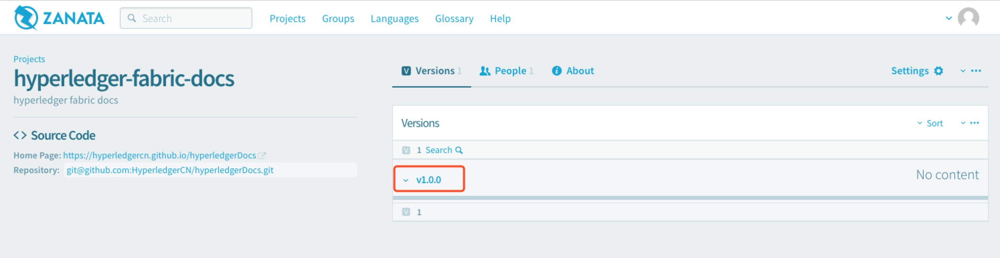

| 原文 | 作者 | 审核修正 |
| --- | --- | --- |
| 无 | 于林生 |  |

## Zanata

[Zanata](http://zanata.org/)是一个基于网络的翻译平台，用于翻译者、内容创作者和开发人员来管理本地化项目。

为了更好的管理、推广、翻译Hyperledger国际化文档，工作组尝试使用zanata翻译平台。

* [Zanata官方快速使用指南](http://docs.zanata.org/en/release/user-guide/translator-guide/)
* [Zanata官方文档](http://docs.zanata.org/en/release/)

## 用Zanata翻译Hyperledger文档

1. 注册用户并登陆
2. 查找并单击进入项目`hyperledger-fabric-docs`

3. 单击选择版本号

4. 单击选择语言

5. 单击选择要翻译的文件

6. 在右侧编辑翻译

    在右侧输入译文，编辑完后会自动保存；下侧是翻译提示内容，可直接`copy`；也可以点击`使用新版`体验新版翻译页面。

    **注意：翻译中的固定术语尽量按照翻译提示统一命名，以免混乱！！！**

新版翻译页面
