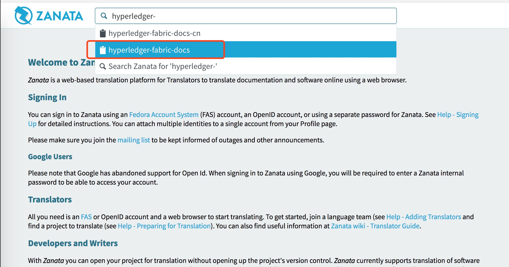
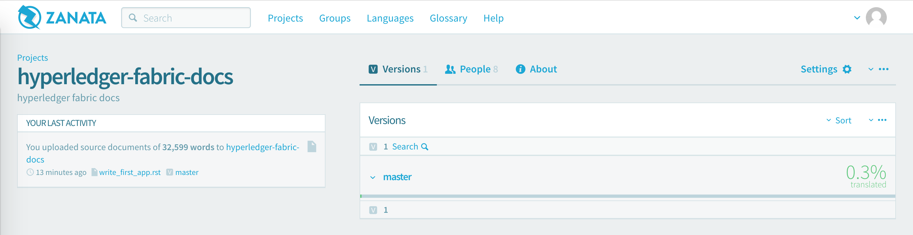
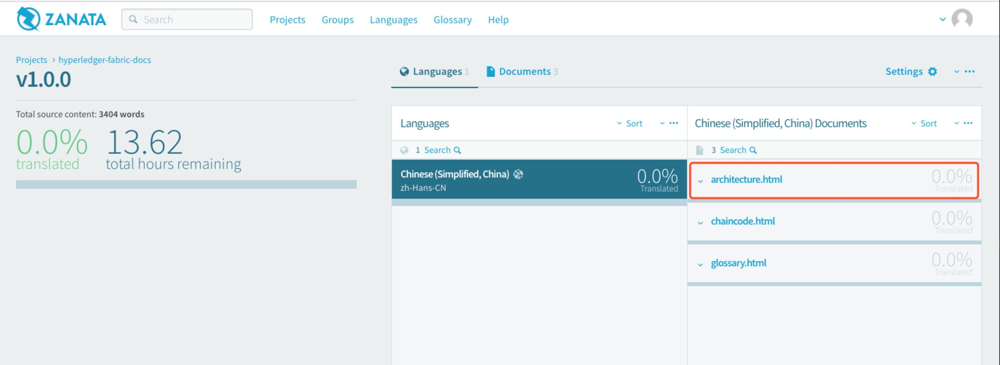
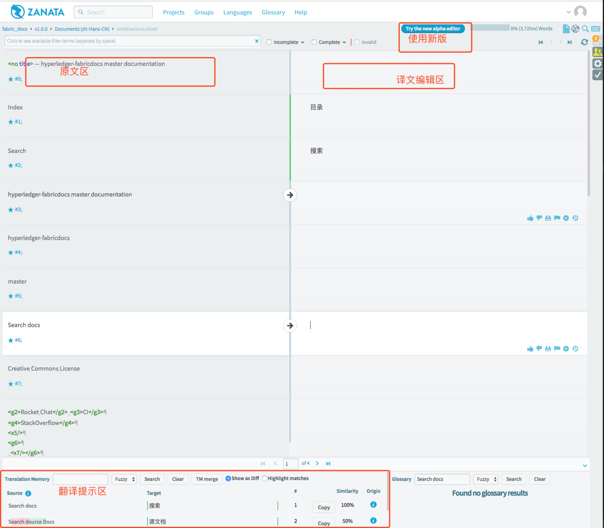
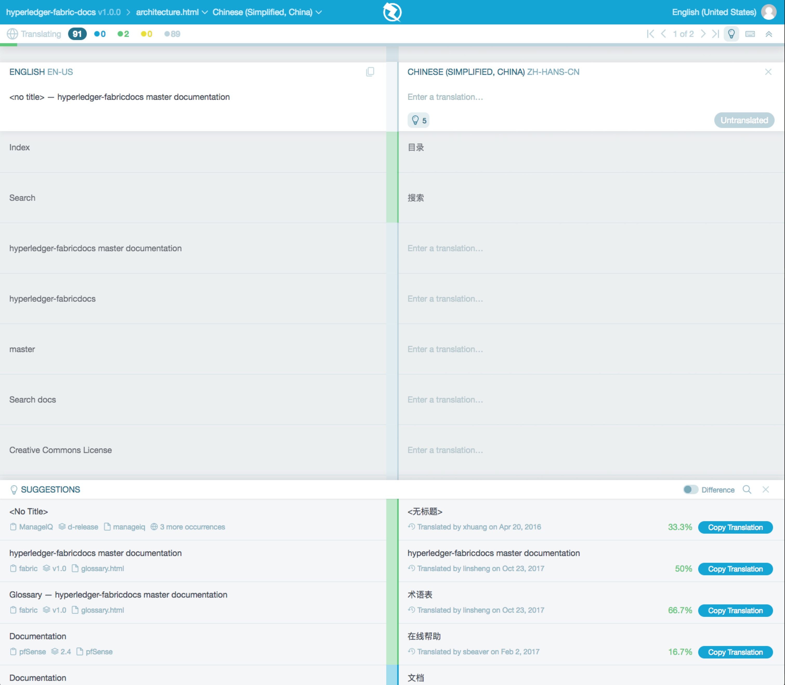
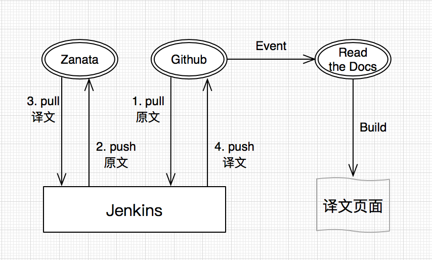

| 原文 | 作者 | 审核修正 |
| --- | --- | --- |
| 无 | 于林生 |  |

## Zanata

[Zanata](http://zanata.org/)是一个基于网络的翻译平台，用于翻译者、内容创作者和开发人员来管理本地化项目。

为了更好的管理、推广、翻译Hyperledger国际化文档，工作组尝试使用zanata翻译平台。

* [Zanata官方快速使用指南](http://docs.zanata.org/en/release/user-guide/translator-guide/)
* [Zanata官方文档](http://docs.zanata.org/en/release/)

## 用Zanata翻译Hyperledger文档

1. 注册用户并登陆

    注册新用户，并将您的Zanata ID添加至项目组[wiki页面](https://wiki.hyperledger.org/groups/twgc/team_ie)。

2. 申请加入Zanata中文团队

    通过`Launguage`->`Chinese (Simplified, China)`->`Request to Join`，申请加入Zanata中文翻译团队。通常这个申请只需要一两天就可以被通过。若两天后您的申请仍处于`pending`状态，请联系Linsheng Yu或Jiannan Guo。

3. 查找并单击进入项目`hyperledger-fabric-docs`

4. 单击选择版本号

5. 单击选择语言

6. 单击选择要翻译的文件（或先6后5）

7. 在右侧编辑翻译

    在右侧输入译文，编辑完后会自动保存；下侧是翻译提示内容，可直接`copy`；也可以点击`使用新版`体验新版翻译页面。

    **注意：翻译中的固定术语尽量按照翻译提示统一命名，以免混乱！！！**

    **注意：翻译中的原文特有的格式符号（如`---`、`====`等）一定要保留！！！**

    

    新版翻译页面
    

8. 译文显示
    
    点击[查看译文](http://hyperledger-zh.readthedocs.io/zh_CN/latest/)，**译文设置为20分钟自动编译更新一次**，所以请不要着急，接着翻译其他内容，等一会儿就能看到译文了。

9. 原文更新
    
    fabric官方源文档更新后，会有专人跟新Zanata上的原文。原文更新后，变化的地方如果被翻译过则译文会被删除掉，同时文档完成度会降低。

## Zanata + Github + Read the Docs

目前使用Jenkins实现了Zanata+github+Read the docs的集成。**Jenkins20分钟自动编译一次**，编译过程包括见下图。

